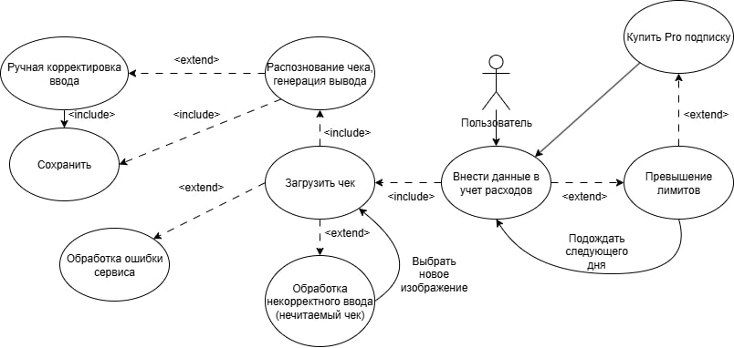

# D2 — USE-CASE NARRATIVE: AI Expense Tracker

## Use-Case: Автоматическая категоризация и анализ расходов

- **Actor:**  Пользователь (зарегистрированный и авторизованный)

- **Goal:** Автоматически зафиксировать расходы через фото чека или скриншот из банка и получить аналитику расходов и рекомендации по ним

## 1. Happy Path (Основной успешный сценарий)

**Описание:** Пользователь успешно отправляет чек и категоризирует расходы с первого раза.

**Шаги:**
1. **Начало:** Пользователь нажимает "Добавить чек" на главном экране
2. **Ввод данных:** Приложение предлагает пользователю выбрать фотографию из галереи
3. **Генерация:** Пользователь выбирает чек из галереи и жмет "Отправить"
4. **Обработка:** Фронтенд отправляет изображение на бэкенд. Бэкенд распознает текст на чеке через OCR и отправляет данные в ИИ-модель для категоризации, получает и отображает ответ
5. **Пример результата:** Система отображает сгенерированную запись:
   - Сумма: 200 руб.
   - Магазин: Кофемания
   - Категория: Продукты
   - Дата: 25.09.2025
   - Совет: сократить недельные траты на кофе навынос
6. **Завершение:** Пользователь проверяет данные и сохраняет их

**Преимущества:**
- **Экономия времени:** Пользователь получает готовый результат за несколько секунд
- **Советы по расходам:** Приложение подчеркивает, на какие расходы следует обратить внимание
- **Автоматизация:** Избавление от рутины по ведению учета расходов

## 2. Alternative Flows (Альтернативные сценарии)

### Альтернативный сценарий 1: Ручная корректировка категории

**Описание:** AI неправильно определил категорию, и пользователь исправляет ее вручную.

**Шаги:**
1. Шаги 1-5 из Happy Path
2. **Обнаружение ошибки:** Пользователь видит, что ИИ определил покупку в "Азбуке Вкуса" как "Рестораны", хотя это были продукты
3. **Действие:** В графе "Категория" пользователь меняет на нужное
4. **Обучение ИИ:** Система запоминает выбор
5. **Сохранение:** Пользователь сохраняет исправленную запись

**Преимущества:**
- **Гибкость:** Возможность быстро исправить ошибку ИИ
- **Персонализация:** Система обучается на исправлениях

### Альтернативный сценарий 2: Пакетная обработка чеков

**Описание:** Пользователь добавляет несколько чеков за раз для массовой обработки.

**Шаги:**
1. **Начало:** Пользователь нажимает "Добавить чек" на главном экране
2. **Ввод данных:** Выбирает несколько фото чеков из галереи
3. **Обработка:** Система последовательно обрабатывает каждый чек
4. **Результат:** Отображается список всех распознанных расходов с возможностью корректировки каждого чека отдельно
5. **Сохранение:** Пользователь сохраняет все записи

**Преимущества:**
- **Эффективность:** Обработка нескольких чеков за раз
- **Удобство:** Не нужно сканировать каждый чек отдельно

## 3. Error Handling (Обработка ошибок)

### Сценарий ошибки 1: Технический слой приложения

**Триггер:** Пользователь выбирает фото чека, но сервис не может его обработать из-за внутренней ошибки.

**Реакция системы:**
- Отобразить сообщение о временной недоступности сервиса
- Отправить на бэкенд код ошибки
- Показать кнопку "Повторить попытку"

### Сценарий ошибки 2: Некорректный ввод (нечитаемый чек)

**Триггер:** Пользователь фотографирует размытый или поврежденный чек, который невозможно распознать.

**Реакция системы:**
- Подсветить изображение красной рамкой
- Показать сообщение о невозможности распознавания
- Предложить ввести данные вручную
- Кнопка "Сохранить" остается неактивной до исправления ошибки

**User Value:** Пользователю сообщают о некорректных данных до отправки запроса, что экономит время

### Сценарий ошибки 3: Превышение лимитов для бесплатного тарифа

**Триггер:** Пользователь с бесплатным тарифом пытается обработать 11-й чек за сутки при лимите в 10.

**Реакция системы:**
- Блокировка обработки на бэкенде
- Модальное окно: "Вы достигли суточного лимита обработки чеков. Перейдите на Pro-тариф для неограниченного использования"
- Предложение trial-периода: "Попробуйте тариф Pro на 7 дней бесплатно"

**User Value:** Понимание ограничений сервиса и предложение их снять

Ниже представлена диаграмма основного Use-Case.

---

### Definition of Done

- [x] Описан детальный Happy Path для основного use-case "Создание персонализированного недельного плана питания".
- [x] Определены 2 альтернативных сценария (Корректировка плана, Неполный ввод данных).
- [x] Описаны 3 сценария ошибок (Технический сбой, Некорректный ввод, Превышение лимитов).
- [x] Для каждого сценария указана конкретная ценность для пользователя.
- [x] Создана Use-case UML диаграмма в формате Mermaid.
- [x] Документ сохранен как `docs/use-cases.md`.
- [x] Проведен walkthrough всех сценариев с командой, получен ✅ от каждого участника.